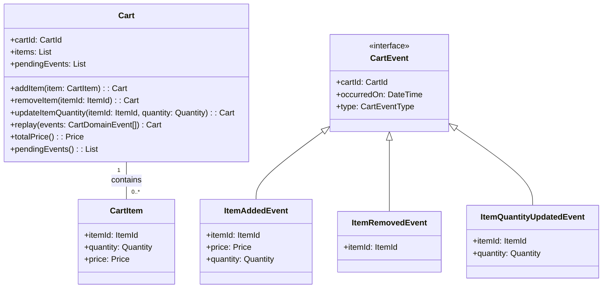

# カートコンテキスト

## ドメインモデル図

```mermaid
classDiagram
  class Cart {
    +cartId: CartId
    +items: List<CartItem>
    +pendingEvents: List<CartDomainEvent>
    +addItem(item: CartItem): Cart
    +removeItem(itemId: ItemId): Cart
    +updateItemQuantity(itemId: ItemId, quantity: Quantity): Cart
    +replay(events: CartDomainEvent[]) Cart
    +totalPrice(): Price
    +pendingEvents(): List<CartDomainEvent>
  }

  class CartItem {
    +itemId: ItemId
    +quantity: Quantity
    +price: Price
  }

  class CartEvent {
    <<interface>>
    +cartId: CartId
    +occurredOn: DateTime
    +type: CartEventType
  }

  class ItemAddedEvent {
    +itemId: ItemId
    +price: Price
    +quantity: Quantity
  }

  class ItemRemovedEvent {
    +itemId: ItemId
  }

  class ItemQuantityUpdatedEvent {
    +itemId: ItemId
    +quantity: Quantity
  }

  CartEvent <|-- ItemAddedEvent
  CartEvent <|-- ItemRemovedEvent
  CartEvent <|-- ItemQuantityUpdatedEvent
  Cart "1" -- "0..*" CartItem: contains
```
