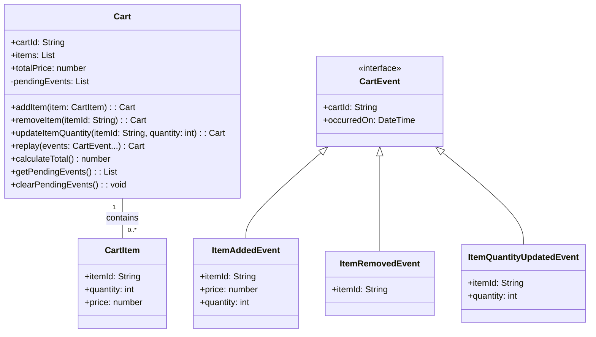

# カートコンテキスト

## ドメインモデル図

```mermaid
classDiagram
  class Cart {
    +cartId: String
    +items: List<CartItem>
    +totalPrice: number
    -pendingEvents: List<CartEvent>
    +addItem(item: CartItem): Cart
    +removeItem(itemId: String): Cart
    +updateItemQuantity(itemId: String, quantity: int): Cart
    +replay(events: CartEvent...) Cart
    +calculateTotal() number
    +getPendingEvents(): List<CartEvent>
    +clearPendingEvents(): void
  }

  class CartItem {
    +itemId: String
    +quantity: int
    +price: number
  }

  class CartEvent {
    <<interface>>
    +cartId: String
    +occurredOn: DateTime
  }

  class ItemAddedEvent {
    +itemId: String
    +price: number
    +quantity: int
  }

  class ItemRemovedEvent {
    +itemId: String
  }

  class ItemQuantityUpdatedEvent {
    +itemId: String
    +quantity: int
  }

  CartEvent <|-- ItemAddedEvent
  CartEvent <|-- ItemRemovedEvent
  CartEvent <|-- ItemQuantityUpdatedEvent
  Cart "1" -- "0..*" CartItem: contains
```